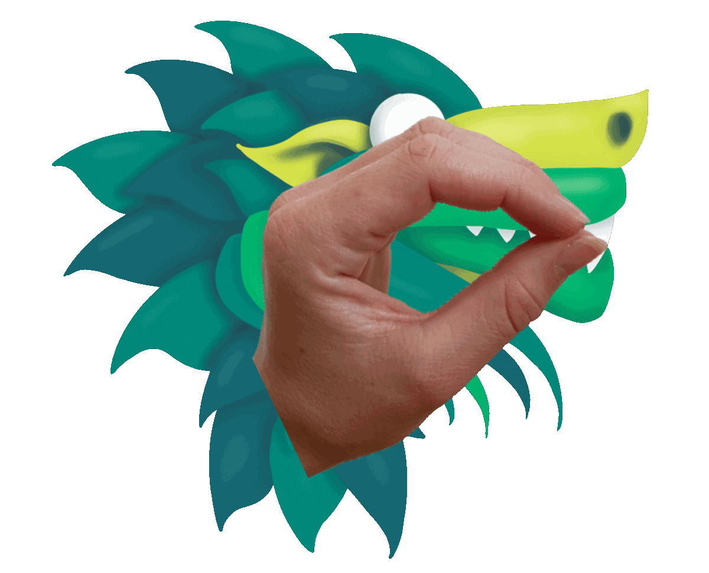
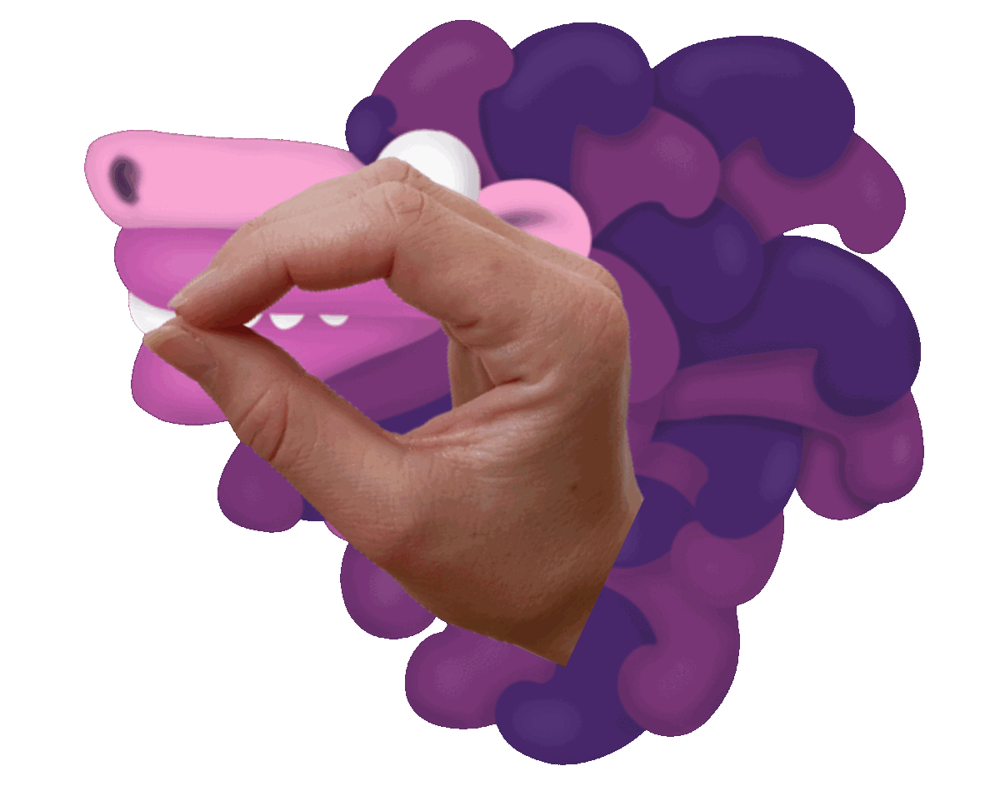

# Dragon Snacks
<!-- todo: add illustration when illustration assets are ready

  

 -->

In this AR scenario, the player's hands become dragons by overlaying dragon images over the hands, which is an example of the segment overlay pattern. The player uses their hands to directly control these dragons and interact with the game.
 
* _Use Case_: anchored complement
* _Technology Platform_: [SnapAR](../README.md)
* _Device Type_: handheld with front camera or computer with webcam
* _Vision System_: mirrored face camera 

This game was developed as part of a Master's tesis, with the goal to investigate different types of embodied hand gesture interaction in mobile AR games.

#### Hand Gestures
The dragon heads are imitated by the hands. These gestures are examples of direct embodied hand gesture interaction because the gestures give the illusion that the hands are the dragons. This feeling is intensified by hiding the hands behind the dragon head graphics. For illustration purposes, the hands are shown in front of the dragon graphics:

  
  

#### Gameplay

There is food falling from the top of the screen. The dragons need to eat the correct food. The left dragon only likes salty food, while the right dragon only likes sweet food. For simplicity, the dragons and their desired food are colored consistently. Eating a correct food item gives one point while eating a wrong one subtracts one point. The goal is to eat as much correct food as possible. 

The food falls down in formations. Instead of eating every food item individually, the dragons can keep their mouth open to accumulate food. When they close their mouth, they swallow the food and the score is updated accordingly. Apart from the food falling from the top of the screen, there are also bombs falling down. When a dragon gets too close to a bomb with its mouth, it gets stunned. If it had food in the mouth that it did not swallow, this food gets removed from the mouth and the score is not updated. The stunned state lasts for 10 seconds. During this time, the dragon cannot open its mouth. We show the stunned state visually using different dragon head graphics. If both dragons are stunned at the same time, then the game is over.

  

#### Play the Game
1. Download [Lens Studio 4.31](https://ar.snap.com/download/v4-31). The game only works with this version.
2. Open [dragon_game.lsproj](LensStudio/dragon_game.lsproj) in Lens Studio
3. Play the game inside Lens Studio using [Webcam Mode](https://developers.snap.com/lens-studio/lens-studio-workflow/previewing-your-lens). The game is optimized for iPhone X, therefore, choose *iPhone X* for [Device Simulation](https://developers.snap.com/lens-studio/lens-studio-workflow/previewing-your-lens) and press the button *Simulate device's FOV*. You should see the following screen:

  

##### Gesture Training
In this mode, you can train performing the gestures to open and close the mouth, as shown in Section [Hand Gestures](#hand-gestures).
> [!TIP]
> For the best tracking experience, perform the gestures parallel to the screen/camera.

##### Tutorial
In the tutorial, you can learn how to play the game. Since the tutorial was designed for a user study where the interviewer explained the game, it does not contain any explanations. To follow along the tutorial, either study Section [Gameplay](#gameplay) or read the [tutorial](graphics/Dragon_Snacks_Tutorial.pdf) while playing along. 

The game consists of four manually designed levels with gradually increased difficulty.

### AR Patterns

__Behavior Patterns__

For simplicity, the behavior patterns for playing sounds are not included below.

* [Complementary Reactions](https://github.com/ARpatterns/catalog/blob/main/behavioral-patterns/complementary-reactions.md): When the mouth open gesture is performed, then the dragon head with the mouth open is displayed, otherwise, when the mouth closed gesture is performed, then the dragon head with the mouth closed is displayed.
  * _Event_: on mouth open/closed

* [Conditional Reaction](https://github.com/ARpatterns/catalog/blob/main/behavioral-patterns/conditional-reaction.md): When the dragon mouth has food in it and the mouth closed gesture is performed, then the food is swallowed and the score is updated.
  * _Event_: on mouth closed

* [Continuous Evaluation](https://github.com/ARpatterns/catalog/blob/main/behavioral-patterns/continous-evaluation.md): The hands are continuously being tracked and the position of the dragon heads is updated to overlay the hands.
  * _Event_: on hand tracking updated

* [Instant Reaction](https://github.com/ARpatterns/catalog/blob/main/behavioral-patterns/instant-reaction.md): When the hand tracking is lost because the hand left the camera space or due to tracking issues, the dragon head is removed.
  * _Event_: on hand tracking lost

* [Instant Reaction](https://github.com/ARpatterns/catalog/blob/main/behavioral-patterns/instant-reaction.md): When the hand tracking is resumed because the hand moved into the camera space or tracking issues were resolved, the dragon head is added again.
  * _Event_: on hand tracking resumed

* [Instant Reaction](https://github.com/ARpatterns/catalog/blob/main/behavioral-patterns/instant-reaction.md): When the dragon head touches a bomb, the dragon gets stunned. Therefore, the stunned head is shown instead of the normal dragon head and the stunned UI graphic is shown on the top corner. This graphic helps to see if the dragon is stunned even if the hand/dragon is not visible in the screen.
  * _Event_: on bomb touched

* [Timed Reaction](https://github.com/ARpatterns/catalog/blob/main/behavioral-patterns/timed-reaction.md): Ten seconds after the dragon head has touched a bomb, the stunning is revoked, resulting in removing the stunned UI graphic on the top corner and replacing the stunned dragon head with the normal dragon head.
  * _Event_: 10 seconds after on bomb touched

__Augmentation Pattern__
* [Segment Overlay](https://github.com/ARpatterns/catalog/blob/main/augmentation-patterns/segment-overlay.md): The dragon heads are placed as overlays over the hands, which gives the illusion that the hands are the dragons.
  * _Placed_: on the screen at the location of the hand
  * _Aligned_: flat on top of the hand as an overlay

## ECA Diagram

  | on:mouth open	| &rarr;	| do:hide | 
  |---|---|---|
  > dragon head with mouth closed

  | on:mouth open	| &rarr;	| do:unhide | 
  |---|---|---|
  > dragon head with mouth open

  | on:mouth closed	| &rarr;	| do:hide | 
  |---|---|---|
  > dragon head with mouth open

  | on:mouth closed	| &rarr;	| do:unhide | 
  |---|---|---|
  > dragon head with mouth closed

  | on:mouth closed	| if:`food items in mouth > 0` | do:updateScore | 
  |---|---|---|

  | on:mouth closed	| if:`food items in mouth > 0` | do:remove | 
  |---|---|---|
  > food items in mouth

  | on:hand tracking updated	| &rarr;	| do:translate | 
  |---|---|---|
  > dragon head to updated hand tracking position

  | on:hand tracking lost	| &rarr;	| do:hide | 
  |---|---|---|
  > dragon head

  | on:hand tracking resumed	| &rarr;	| do:unhide | 
  |---|---|---|
  > dragon head

  | on:bomb touched	| &rarr;	| do:unhide | 
  |---|---|---|
  > stunned dragon head & stunned UI graphic on top corner

  | on:bomb touched	| &rarr;	| do:hide | 
  |---|---|---|
  > normal dragon head

  | in:10 (after on: bomb touched) | &rarr;	| do:unhide | 
  |---|---|---|
  > normal dragon head

  | in:10	(after on: bomb touched) | &rarr;	| do:hide | 
  |---|---|---|
  > stunned dragon head & stunned UI graphic on top corner

### Links
* _Source Code_: [LensStudio/Public/Scripts](LensStudio/Public/Scripts)

## References
- [Lens Studio 4.31](https://ar.snap.com/download/v4-31): The game only works with this version, other versions do not work properly with the hand tracking.

## Credits
All the games were created as part of Martina Kessler's Master's thesis at [GTC](https://gtc.inf.ethz.ch).

### Contributions
- Martina Kessler: implementation
- [Dr. Julia Chatain](https://juliachatain.com): supervision & graphics
- Dr. Fabio Zünd: supervision

### Sounds
- Eating: Crunching on a bell pepper by greenlinker -- https://freesound.org/s/757510/ -- License: Creative Commons 0
- Explosion: Bomb_kl.aiff by scarbelly25 -- https://freesound.org/s/33874/ -- License: Creative Commons 0
- Mmmh: Mmmm! by doggo_mcdoggo -- https://freesound.org/s/368592/ -- License: Creative Commons 0
- Urgh: Man vomit or get hurt by Piement_infernal -- https://freesound.org/s/772689/ -- License: Creative Commons 0