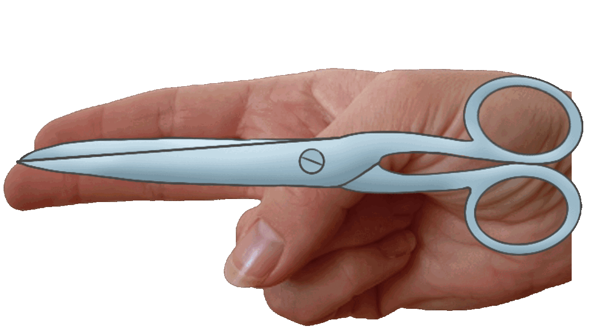
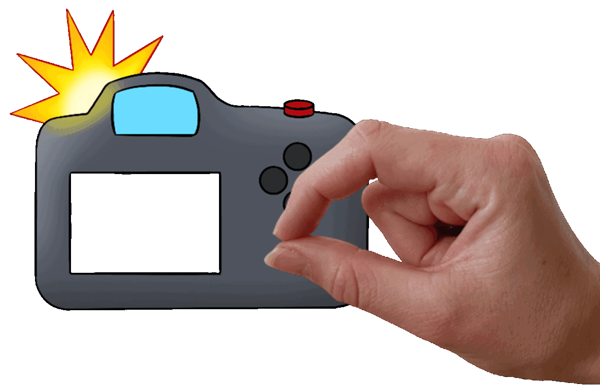

# Ocean Clean-Up
<!-- todo: add illustration when illustration assets are ready

  

 -->

In this AR scenario, the player controls the scissors and the camera to interact with the game. The player can imitate the scissors, and they appear on top of their hands. This is an example of the segment overlay pattern. To use the camera, the player imitates holding a the camera, which is an example of the anchored supplement pattern.

* _Use Case_: anchored complement
* _Technology Platform_: [SnapAR](../README.md)
* _Device Type_: handheld with front camera or computer with webcam
* _Vision System_: mirrored face camera 

This game was developed as part of a Master's tesis, with the goal to investigate different types of embodied hand gesture interaction in mobile AR games.

#### Hand Gestures & Gameplay

The player is diving underwater. There is a hook coming down from the top of the screen. Without interacting with the game, the following happens: If a fish swims into the hook, the hook picks it up and pulls it out of the water. Otherwise, the hook reaches the sea floor and picks up a trash item.

The goal of the game is to pick up all the trash while picking up as few fish as possible. To achieve this goal, the player has two options: interacting with the game using the scissors or the camera gesture.

The player can cut the rope of the hook with the scissors. If a fish or trash item is on this hook, then they are released.

  
  

 

Another way to interact with the game is by taking pictures of fish. The camera takes a picture of all the fish visible in the camera screen. Those fish pose for the picture, thus remaining in the same place for two seconds. Additionally, the fish show their true color for the picture. To indicate the two seconds time interval, the color of the fish gradually fades. This mechanic can be used to stop the fish from moving into the hook. For illustration purposes, the camera gesture is shown in front of the camera graphics.

  
  

 

The game is over when all the trash is picked up from the sea floor. It is a score-based game. The score is explained in the table below. 

  

 

| Action | Points |
|---|:---:|
| Pulling out a trash item | 5 |
| Taking a picture of a fish | 1 |
| Picking up a fish | -1 |
| Pulling out a fish | -5 |

#### Play the Game
1. Download [Lens Studio 4.31](https://ar.snap.com/download/v4-31). The game only works with this version.
2. Open [fish_game.lsproj](LensStudio/fish_game.lsproj) in Lens Studio
3. Play the game inside Lens Studio using [Webcam Mode](https://developers.snap.com/lens-studio/lens-studio-workflow/previewing-your-lens). The game is optimized for iPhone X, therefore, choose iPhone X for [Device Simulation](https://developers.snap.com/lens-studio/lens-studio-workflow/previewing-your-lens). You should see the screen on the left.
4. Choose your dominant hand. It will be the hand you use for the camera gesture. For the scissors gesture, you can either use the same hand and switch between the gestures. However, user testing has shown that switching between these two gestures can be difficult. Therefore, it is recommended to use the other hand for the scissors gesture. After choosing the dominant hand, you should see the screen on the right.

  
  

##### Gesture Training
In this mode, you can train performing the gestures to open and close the mouth, as shown in Section [Hand Gestures & Gameplay](#hand-gestures--gameplay).
> [!TIP]
> For the best tracking experience, perform the gestures parallel to the screen/camera.

##### Tutorial
In the tutorial, you can learn how to play the game. Since the tutorial was designed for a user study where the interviewer explained the game, it does not contain any explanations. To follow along the tutorial, either study Section [Hand Gestures & Gameplay](#hand-gestures--gameplay) or read the [tutorial](graphics/Ocean_Clean-Up_Tutorial.pdf) while playing along. 

The game consists of four randomly generated levels. For all the levels, five trash items are lying on the sea floor. The speed and the number of fish increase gradually for harder levels.

### AR Patterns

__Behavior Patterns__

For simplicity, the behavior patterns for playing sounds are not included below.

* [Complementary Reactions](https://github.com/ARpatterns/catalog/blob/main/behavioral-patterns/complementary-reactions.md): When the scissors open gesture is performed, then the open scissors are displayed.
  * _Event_: on scissors open

* [Complementary Reactions](https://github.com/ARpatterns/catalog/blob/main/behavioral-patterns/complementary-reactions.md): When the camera start gesture is performed, then the camera without flash is displayed.
  * _Event_: on camera start

* [Chain Reaction](https://github.com/ARpatterns/catalog/blob/main/behavioral-patterns/chain-reaction.md): Only after the scissors opened gesture is performed, then the scissors closed gesture can be recognized. If the scissors touch the rope or hook, then the rope is cut. If a fish was attached to the hook, then it is freed, blood drops are added to it and it continues to swim. Otherwise, if a trash item was attached to the hook, then it is dropped and falls back onto the sea floor.
  * _Event_: on scissors closed

* [Chain Reaction](https://github.com/ARpatterns/catalog/blob/main/behavioral-patterns/chain-reaction.md): Only after the camera start gesture is performed, then the camera trigger gesture can be recognized. If there are fish visible inside the camera screen when performing the camera trigger gesture, then all those fish stop for 2 seconds, and their true color reveils. It gradually fades during those two seconds to indicate the end of the two seconds interval.
  * _Event_: on camera trigger

* [Continuous Evaluation](https://github.com/ARpatterns/catalog/blob/main/behavioral-patterns/continous-evaluation.md): The hands are continuously being tracked and the position of the camera and scissors is updated to overlay the hands while that gesture is perfmormed.
  * _Event_: on hand tracking updated

__Augmentation Pattern__
* [Segment Overlay](https://github.com/ARpatterns/catalog/blob/main/augmentation-patterns/segment-overlay.md): The scissors are placed as overlays over the hand, which gives the illusion that the hand is the scissors.
  * _Placed_: on the screen at the location of the hand
  * _Aligned_: flat on top of the hand as an overlay

* [Anchored Supplement](https://github.com/ARpatterns/catalog/blob/main/augmentation-patterns/anchored-supplement.md): The camera is placed at a fixed distance from the hand. The hand remains visible and gives the illusion that the hand is holding the camera and pressing the trigger to take a picture.
  * _Anchored_: to the hand
  * _Placed_: to the left/right of the index finger and thumb tip
  * _Aligned_: with the hand
  * _Camera_: front camera

## ECA Diagram

  | on:scissors open	| &rarr;	| do:hide | 
  |---|---|---|
  > closed scissors

  | on:scissors open	| &rarr;	| do:unhide | 
  |---|---|---|
  > open scissors

  | on:scissors closed	| if:`previous gesture == scissors open`	| do:hide | 
  |---|---|---|
  > open scissors

  | on:scissors closed	| if:`previous gesture == scissors open`	| do:unhide | 
  |---|---|---|
  > closed scissors

  | on:scissors closed	| if:`previous gesture == scissors open`	| do:cutRope | 
  |---|---|---|

  | on:camera start	| &rarr;	| do:hide | 
  |---|---|---|
  > camera with flash

  | on:camera start	| &rarr;	| do:unhide | 
  |---|---|---|
  > camera without flash

  | on:camera trigger	| if:`previous gesture == camera start`	| do:hide | 
  |---|---|---|
  > camera without flash

  | on:camera trigger	| if:`previous gesture == camera start`	| do:unhide | 
  |---|---|---|
  > camera with flash

  | on:camera trigger	| if:`previous gesture == camera start`	| do:takePicture | 
  |---|---|---|

  | on:hand tracking updated	| &rarr;	| do:translate | 
  |---|---|---|
  > scissors or camera to updated hand tracking position

### Links
* _Source Code_: [LensStudio/Public/Scripts](LensStudio/Public/Scripts)

## References
- [Lens Studio 4.31](https://ar.snap.com/download/v4-31): The game only works with this version, other versions do not work properly with the hand tracking.

## Credits
All the games were created as part of Martina Kessler's Master's thesis at [GTC](https://gtc.inf.ethz.ch).

### Contributions
- Martina Kessler: implementation
- [Dr. Julia Chatain](https://juliachatain.com): supervision & graphics
- Dr. Fabio Zünd: supervision

### Sounds
- Camera click: DSLR Camera Click by akonze -- https://freesound.org/s/157812/ -- License: Creative Commons 0
- Scissors: scissors_cut_3.wav by StarTowerStudio -- https://freesound.org/s/426824/ -- License: Creative Commons 0
- Hook: camera flash charge.wav by adeluc4 -- https://freesound.org/s/125326/ -- License: Creative Commons 0
- Success: Powerup/success.wav by GabrielAraujo -- https://freesound.org/s/242501/ -- License: Creative Commons 0
- Failure: Failure Drum Sound Effect 1.mp3 by FunWithSound -- https://freesound.org/s/456962/ -- License: Creative Commons 0
