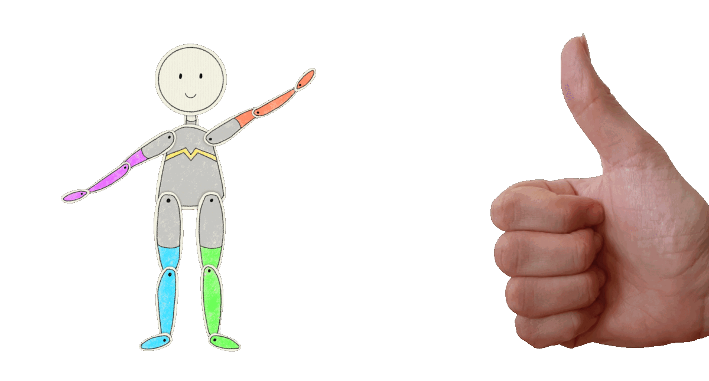

# Puppet Dance
<!-- todo: add illustration when illustration assets are ready

  

 -->

In this AR scenario, the player controls the pose of the puppet through hand gestures. For visual feedback, the tracked hand skeleton is overlaid over the real hand, which is an example of the superimposition pattern.

* _Use Case_: anchored complement
* _Technology Platform_: [SnapAR](../README.md)
* _Device Type_: handheld with front camera or computer with webcam
* _Vision System_: mirrored face camera 

This game was developed as part of a Master's tesis, with the goal to investigate different types of embodied hand gesture interaction in mobile AR games.

#### Hand Gestures
The pose of the puppet is indirectly represented by gestures. The thumbs up gesture represents the base pose with both arms up and both legs down. When the thumb is moved down, then the arm moves down. To move the leg up, the palm is extended. The left hand controls the left body part and the right one the right body part. This hand gesture interaction is an example of an indirect embodied interaction as the hand gestures do not directly represent the puppet, but each hand gesture indirectly represents the pose of the puppet.

  

#### Gameplay

In this game, there are poses falling from the top of the screen. The player needs to bring the puppet into the same pose as the current falling pose. When the falling pose reaches the stage, then the evaluation is triggered. If the pose of the controlled puppet is correct, a green light flashes up. Otherwise, a red light flashes up to indicate that the pose was wrong. After the evaluation, a new pose is spawned and falls from the top of the screen. As a visual helper, the tracked hand skeleton is colored in the same color as the body part of the puppet it controls. 

The game consists of two choreographies. The difficulty of the choreographies is gradually increased by adding more changes between subsequent poses. The goal is to perform as many correct poses as possible. When the choreography is over, the number of correct poses is shown on the screen and an applause sound is played.

  

#### Play the Game
1. Download [Lens Studio 4.31](https://ar.snap.com/download/v4-31). The game only works with this version.
2. Open [dance_game.lsproj](LensStudio/dance_game.lsproj) in Lens Studio
3. Play the game inside Lens Studio using [Webcam Mode](https://developers.snap.com/lens-studio/lens-studio-workflow/previewing-your-lens). The game is optimized for iPhone X, therefore, choose *iPhone X* for [Device Simulation](https://developers.snap.com/lens-studio/lens-studio-workflow/previewing-your-lens) and press the button *Simulate device's FOV*. You should see the following screen:

  

##### Gesture Training
In this mode, you can train performing the gestures to move the arms and legs of the puppet, as shown in Section [Hand Gestures](#hand-gestures).
> [!TIP]
> For the best tracking experience, perform the gestures parallel to the screen/camera. Pay special attention to performing the palm extended gesture parallel to the camera.

##### Tutorial
In the tutorial, you can practice how to control the puppet. It contains easy dance moves without music, whereas Dance 1 and Dance 2 have more difficult choreographies with music.

### AR Patterns

__Behavior Patterns__

For simplicity, the behavior patterns for playing sounds are not included below.

* [Complementary Reactions](https://github.com/ARpatterns/catalog/blob/main/behavioral-patterns/complementary-reactions.md): When the thumb is moved up, then the puppet arm is moved up, otherwise, when the thumb is moved down, then the puppet arm is moved down.
  * _Event_: on thumbs up/down

* [Complementary Reactions](https://github.com/ARpatterns/catalog/blob/main/behavioral-patterns/complementary-reactions.md): When the palm is extended, then the puppet leg is moved up, otherwise, when the fist gesture is performed, then the puppet leg is moved down.
  * _Event_: on palm extended/fist

* [Conditional Reaction](https://github.com/ARpatterns/catalog/blob/main/behavioral-patterns/conditional-reaction.md): When the falling puppet reaches the stage, the evaluation is triggered. If the controlled puppet performs the same pose as the falling puppet, the stage light lights up green, otherwise, it lights up red.
  * _Event_: on stage reached

* [Continuous Evaluation](https://github.com/ARpatterns/catalog/blob/main/behavioral-patterns/continous-evaluation.md): The hands are continuously being tracked and the skeleton is overlaid onto the hands.
  * _Event_: on hand tracking updated

__Augmentation Pattern__

* [Superimposition](https://github.com/ARpatterns/catalog/blob/main/augmentation-patterns/superimposition.md): The tracked skeleton is displayed on top of the hand. The visualization matches the position and orientation of the real hand.
  * _Anchored_: to the hand
  * _Placed_: on top of the hand
  * _Aligned_: with the hand
  * _Camera_: front camera

## ECA Diagram

  | on:thumbs up	| &rarr;	| do:move | 
  |---|---|---|
  > arm up 

  | on:thumbs down	| &rarr;	| do:move | 
  |---|---|---|
  > arm down

  | on:palm extended	| &rarr;	| do:move | 
  |---|---|---|
  > leg up 

  | on:fist	| &rarr;	| do:move | 
  |---|---|---|
  > leg down 

  | on:stage reached	| if:`pose(falling puppet) == pose(controlled puppet)` | do:show | 
  |---|---|---|
  > green light

  | on:stage reached	| if:`pose(falling puppet) != pose(controlled puppet)` | do:show | 
  |---|---|---|
  > red light

  | on:hand tracking updated	| &rarr;	| do:update | 
  |---|---|---|
  > hand skeleton visualization

### Links
* _Source Code_: [LensStudio/Public/Scripts](LensStudio/Public/Scripts)

## References
- [Lens Studio 4.31](https://ar.snap.com/download/v4-31): The game only works with this version, other versions do not work properly with the hand tracking.

## Credits
All the games were created as part of Martina Kessler's Master's thesis at [GTC](https://gtc.inf.ethz.ch).

### Contributions
- Martina Kessler: implementation
- [Dr. Julia Chatain](https://juliachatain.com): supervision & graphics
- Dr. Fabio Zünd: supervision

### Music
- Disco Medusae Kevin MacLeod ([incompetech.com](https://incompetech.com/music/royalty-free/index.html?isrc=USUAN1500041&Search=Search))\
Licensed under Creative Commons: By Attribution 3.0 License\
http://creativecommons.org/licenses/by/3.0/

### Sounds
- Buzzer: Incorrect Buzzer by Producing_RayLite -- https://freesound.org/s/700641/ -- License: Creative Commons 0
- Applause: CRWDApls_Loud Applause, Cheering, Whistling_ShaneVincent_GSC24_BIN-AmbeoVR.wav by ShangusBurger -- https://freesound.org/s/763932/ -- License: Creative Commons 0